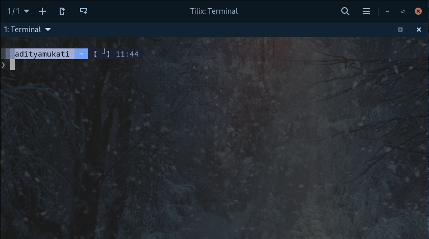
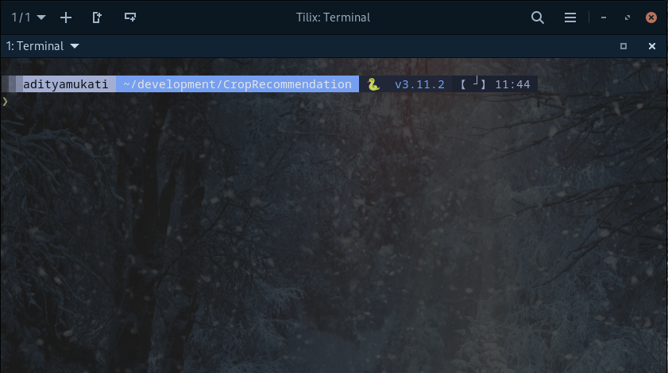

#  Starship Winter

<div align="center">
    <br>
    <b>🎨 Winter theme for <a href="https://starship.rs/">Starship</a></b>
    <br>
    <br>
    <br>
    
    <br>
    <br>
    <br>
    
</div>

## Install

Download the theme and set it as your Starship config.

   ```shell
   mkdir -p ~/.config && curl -o ~/.config/starship.toml \
   https://raw.githubusercontent.com/Aadi61/starship-winter-theme/main/starship.toml
   ```
